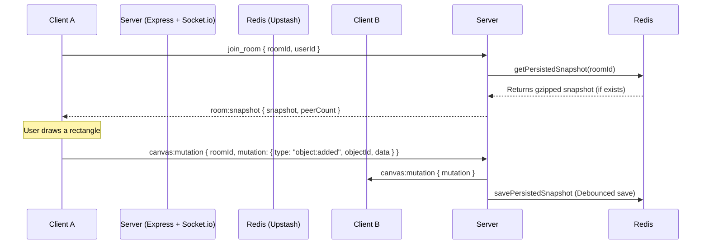

# Synapse Project — AI Integration & Architecture Guide

Welcome, developer! This guide serves as a comprehensive map of the Synapse codebase, explaining its architecture, state synchronization, and extension points for future AI features.

---

## 1. Directory Structure & Monorepo Overview

Synapse is structured as a monorepo containing two main parts:
*   `/app`: The frontend application built on **Next.js 15 (App Router)** and styled using custom glassmorphic CSS.
*   `/server`: The real-time collaboration server built on **Node.js, Express, Socket.io 4, and Upstash Redis**.

```text
/c:/synapse
├── app/                  # Frontend Next.js client
│   ├── app/              # Page routes & global styles (e.g. globals.css)
│   ├── components/       # Core React components (Canvas.tsx, BoardClient.tsx)
│   └── lib/              # Client-side Socket singleton & helper hooks
├── server/               # Collaborative Socket.io backend
│   ├── index.ts          # Express setup & Socket event routers
│   ├── rooms.ts          # State managers for room join/leave
│   ├── redis.ts          # Upstash Redis connector (Gzip compression)
│   └── Dockerfile        # Container recipe for Railway deployments
└── AI_GUIDE.md           # This file!
```

---

## 2. Technology Stack & Canvas Core

### Fabric.js 6 Canvas (`app/components/Canvas.tsx`)
The whiteboard canvas uses **Fabric.js 6**. 
*   **Initialization**: Canvas instances are initialized within a custom `useCallback` inside `Canvas.tsx` and exposed to the parent component (`BoardClient.tsx`) via an `ImperativeHandle` ref.
*   **Drawing & Interaction**:
    *   Supported tools: `select`, `pan`, `rectangle`, `circle`, `arrow`, `text` (Textbox), and `sticky` (Sticky note).
    *   **Custom attributes** (stored inside `EXTRA_PROPS` in Fabric.js objects):
        *   `id`: Cryptographically secure unique identifier (`crypto.randomUUID()`).
        *   `subtype`: Identifies specialty shapes like `'arrow'` or `'sticky'`.
        *   `locked`: Boolean lock attribute. If `true`, the object is exempt from standard pointer selections, moving, resizing, or deletion via keyboard shortcuts.
        *   `textSize`: Current size state (`'small' | 'medium' | 'large'`).
        *   `stickyColor`: Background swatch color for sticky notes.
        *   `stickyTextColor`: Text color for sticky notes (`#ffffff` or `#1a1500`).

---

## 3. Collaboration & Synchronization Protocol

Whiteboard sync operates in real-time using Socket.io mutation-broadcasting:



### Key Socket Events
*   `join_room`: Emitted by the client on mount. The server responds with `room:snapshot` (restoring the canvas state) and increments the peer presence count.
*   `canvas:mutation`: Emitted whenever an object is added, modified, removed, or layered. The packet includes:
    ```typescript
    interface CanvasMutation {
      type: 'object:added' | 'object:modified' | 'object:removed' | 'object:layer';
      objectId: string;
      data: Record<string, unknown>;
      userId: string;
    }
    ```
*   `canvas:snapshot`: Emitted on larger changes to sync full state if required.
*   `cursor:move` / `cursor:click` / `cursor:leave`: Broadcasts real-time mouse pointer presence to render other active users.

---

## 4. State Persistence (Gzip + Upstash Redis)

To ensure faster network synchronization and lower bandwidth costs, the canvas snapshot is gzipped before saving:
*   **Server-Side Compression (`server/redis.ts`)**: 
    Canvas JSON strings are compressed using Node's native `zlib.gzipSync()` and saved in Redis as a `base64` string with a **30-day resetting Time-To-Live (TTL)**.
*   **Graceful Dev Fallback**:
    If Upstash Redis environment variables are missing (e.g. in local development), the server defaults to **in-memory room state storage** and logs a warning, preventing startup crashes.

---

## 5. UI Architecture & Custom Tokens

The design is built with modern, glassmorphic aesthetics defined in `/app/app/globals.css`.
*   **Layers Toggle Button**: Redesigned into a `.hud-bar` capsule at the bottom floating HUD to prevent squishing text inside circular structures. It uses a transition-friendly active state:
    ```css
    .layers-toggle-hud-btn.active {
      background: var(--color-accent-faint) !important;
      color: var(--color-accent) !important;
      border-color: var(--color-accent-dim) !important;
    }
    ```
*   **Right Sliding Layers Panel**: Photoshop/Figma-style panel sliding from the right (`.layers-panel`). Contains lists of all objects in reversed z-index order, showing labels, lock states, and text previews.

---

## 6. Environment Configurations & Deployments

Ensure the following configurations are set on your deployment platforms:

### Frontend (Vercel)
*   `NEXT_PUBLIC_SERVER_URL`: The public URL of the backend Railway deployment (e.g. `https://synapse-production.up.railway.app`).

### Backend (Railway)
*   **Root Directory**: Must be explicitly set to **`/server`** under the service Settings tab. This instructs Railway to ignore the frontend workspace and build using `/server/Dockerfile`.
*   **Variables**:
    *   `PORT`: Must be set to `3001`. This forces Railway to bind Node's listener port to match its exposed proxy target.
    *   `CLIENT_ORIGIN`: Set to the Vercel site's domain (e.g. `https://synapse-ashy-two.vercel.app`).
    *   `UPSTASH_REDIS_REST_URL` & `UPSTASH_REDIS_REST_TOKEN`: Upstash Redis credentials.

---

## 7. AI Integration Extensions

If you are an AI assistant integrating smart features (e.g. AI-assisted diagram generation or voice command layouts), here are your primary hooks:

1.  **Programmatic Object Insertion**:
    You can insert items onto the active Fabric.js canvas from the client side by getting the ref callback:
    ```typescript
    // Inside a custom AI integration script or component:
    const canvas = (window as any).canvas; // Exposed for easy debugging / AI injection
    if (canvas) {
      const rect = new fabric.Rect({
        left: 100,
        top: 100,
        width: 150,
        height: 100,
        fill: '#ffe066',
        id: crypto.randomUUID(), // MUST supply custom UUID
      });
      canvas.add(rect);
      canvas.renderAll();
      // Emit mutation to sync with other peers
      socket.emit('canvas:mutation', { roomId, mutation: { type: 'object:added', objectId: rect.id, data: rect.toObject() } });
    }
    ```
2.  **Snapshot Analysis**:
    To feed the current board layout to a Large Language Model (e.g. Gemini) for summarization, capture the Canvas JSON payload:
    ```typescript
    const snapshot = JSON.stringify(canvas.toJSON(['id', 'subtype', 'locked', 'textSize', 'stickyColor', 'stickyTextColor']));
    // Send snapshot to LLM API...
    ```

---

## 8. Local Diagnostics & Verification Commands

Ensure these commands run clean before committing:
```bash
# Frontend validation
cd app
npm run build              # Verifies production build
npx tsc --noEmit           # Verifies type safety (should have zero output)
npm run lint               # Verifies formatting

# Backend validation
cd server
npm run build              # Compiles TypeScript server script
npx tsc --noEmit           # Verifies types
```

---

*Compiled by Antigravity AI (DeepMind Team).*
